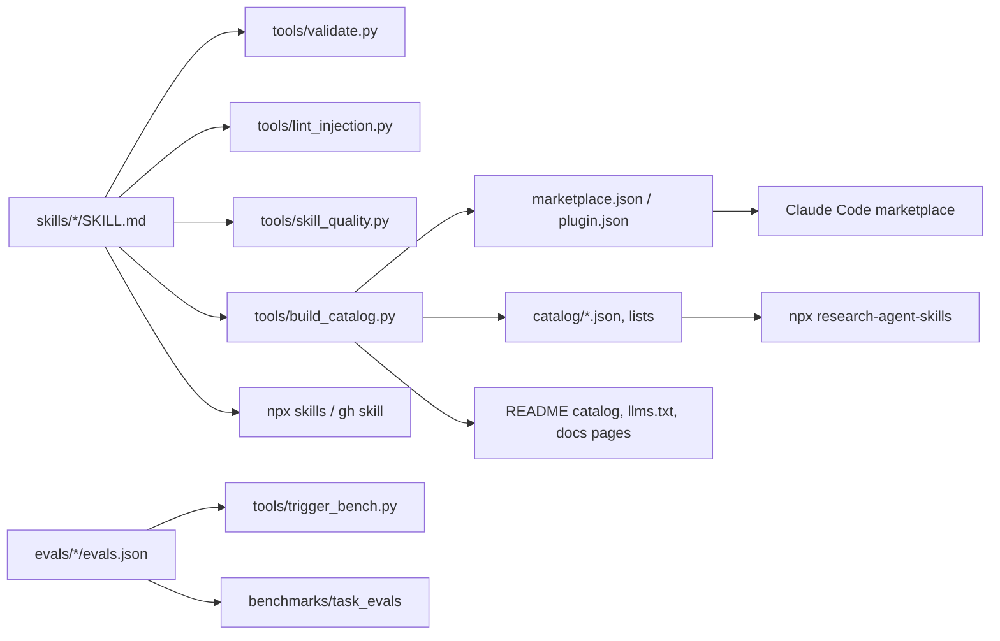

# Architecture

## Repository layout

```text
KalarisLabs/research-agent-skills/
├── skills/<name>/                 # one folder per skill (flat, name == folder)
│   ├── SKILL.md                   # frontmatter (Agent Skills spec) + instructions, ≤ 500 lines
│   ├── references/                # long-form material loaded on demand
│   ├── scripts/                   # tested, standard-library-first CLIs the agent runs
│   └── assets/ templates/         # templates, schemas, examples
├── evals/<name>/evals.json        # trigger and task prompts (kept out of installed skills)
├── benchmarks/                    # citation, slop and task-outcome benchmarks + committed results
├── catalog/                       # GENERATED: skills.json, graph.json/.graphml, lists/*.txt
├── .claude-plugin/marketplace.json# GENERATED: Claude Code marketplace (bundles + categories)
├── plugin.json                    # GENERATED: Agent Plugins manifest (Codex, Cursor, Copilot, gh skill)
├── llms.txt                       # GENERATED: machine-readable index for AI search and agents
├── cli/                           # npm package `research-agent-skills` (TypeScript, zero runtime deps)
├── install.sh / install.ps1       # checksum-verified installers without Node.js
├── tools/                         # Python tooling (validate, lint, catalog, quality, trigger bench, import)
├── third_party/                   # categories, adapted-skill provenance, patches, import configuration
├── security/                      # network allowlist, reviewed-finding baselines
├── tests/                         # pytest: tooling, skill scripts, quality gates
├── docs/                          # MkDocs site (guides, reference; per-skill pages generated)
└── .github/                       # CI workflows, issue/PR templates, CODEOWNERS, Dependabot
```

## Data flow



## Principles

1. **Skills are the product.** Everything else validates, packages or distributes them.
2. **One source of truth.** Manifests, catalog, notices, README tables, `llms.txt` and docs pages are generated from
   `skills/` and `third_party/`, and CI fails if any is stale (`tools/build_catalog.py --check`).
3. **Spec-first portability.** Only Agent Skills spec fields at the top level of frontmatter, so every harness can load every skill.
4. **Deterministic code for deterministic work.** Parsing, validation and conversion live in tested scripts, not in prose.
5. **Defense in depth.** Validation, injection lint, third-party scanner, code scanning, a network allowlist, signed releases and install-time hashes.
6. **Measured quality.** Static rubric → trigger routing → task outcomes (see [Benchmarks](/reference/benchmarks)).

## CI pipelines

| Workflow | Runs on | Purpose |
|---|---|---|
| `validate.yml` | PR, main | Spec, policy, `skills-ref`, generated files, brand guard, reproducible import, harness compatibility |
| `skill-security.yml` | PR, main, weekly | Injection lint (SARIF), Cisco skill-scanner gate |
| `code-security.yml` | PR, main, weekly | CodeQL, Semgrep, Bandit, Ruff, ShellCheck, PSScriptAnalyzer, zizmor, actionlint |
| `supply-chain.yml` | PR, main, daily | TruffleHog, dependency review, pip-audit, npm audit, OSV-Scanner |
| `test.yml` | PR, main | pytest (3 OS × 3 Python), CLI (3 OS × 4 Node), installer end-to-end |
| `benchmarks.yml` | PR, weekly, manual | Quality rubric and trigger gates; citation benchmark; paid model benchmarks on demand |
| `release.yml` | tag `v*` | Verify, build tarball + SHA256SUMS, attest, sign, GitHub release, npm publish with provenance |
| `docs.yml`, `links.yml`, `scorecard.yml` | main / weekly | Docs site, dead links, OpenSSF Scorecard |

## Adapted vs original skills

Adapted skills come from MIT-licensed upstream projects at pinned revisions (`third_party/sources.yaml`) and are
normalized by `tools/import_upstream.py` + `tools/rebrand.py`. Fixes live in `third_party/patches/`, so re-imports keep them.
Original skills are written in this repository. The catalog marks each skill's `origin`, and notices are generated in
`THIRD_PARTY_NOTICES.md`.
